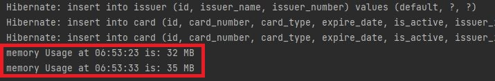
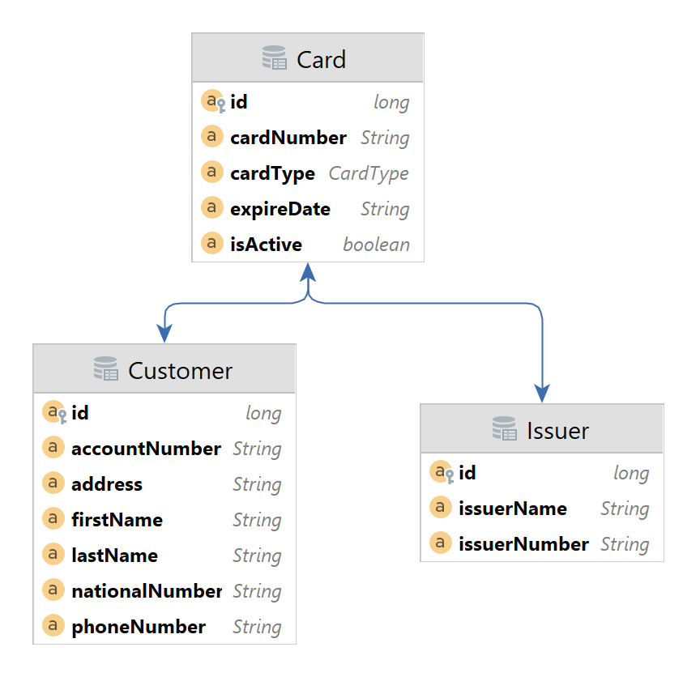

# ISC Java Assignment
This project is the implementation of the given assignment by ISC as a part of recruiting procedure.
The task document can be found in the `assets` directory.

## Install & Run
This project was implemented using Java 18 and spring boot 2.7.5. 
To run the project open the IDE and just run it, then visit `http://localhost:8081`.

Notes:
- It is important to note that the CARD number generation in the newCard API endpoint is handled automatically.
- The OpenAPI (swagger) can be accessed in the `http://localhost:8081/swagger-ui/`.
- The app is using basic auth and the credentials are `user:password`.
- The database in use by default is an in-memory H2 database which is located in `http://localhost:8081/h2-console`
- The database is seeded in the main class populating the `customers`, `cards` and `issuers` tables. 

## Performance & Log Monitoring
You can follow the performance (memory usage) and log at the console output (stdout).

## Schema

Notes:

- For validating the defined constraint stating that "Each customer can only 
have just one type of card from each issuer", we create **composite unique key**
on the columns `issuer_id, customer_id, type`.
purposes 

## Tests
There are several tests included in the `src/test` directory which you can run.
